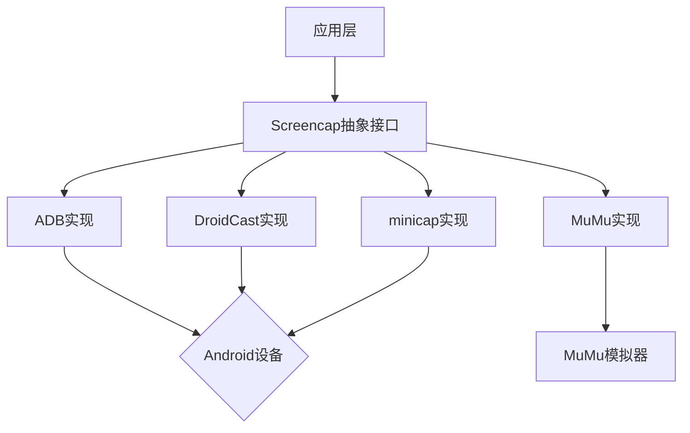

# MSC (Multi-Screencap Control) 框架

## 🌟 特性

- 统一的截图控制抽象接口
- 支持多种底层实现：
  - ADB 原生指令
  - [Droidcast](https://github.com/rayworks/DroidCast) 分支自改版本
  - [minicap](https://github.com/openstf/minicap) Stream real-time screen capture data out of Android devices.
  - [MuMu]() 模拟器专属支持

## 📦 安装

```bash
# 全量安装
uv add git+https://github.com/NakanoSanku/msc
# 选择性安装
# 仅安装minicap方案
uv add git+https://github.com/NakanoSanku/msc#subdirectory=msc-minicap
```

## 🛠️ 实现方案对比

| 特性             | ADB  | Droidcast | minicap                        | MuMu        |
| ---------------- | ---- | --------- | ------------------------------ | ----------- |
| 延迟             | 高   | 低        | 最低                           | 最低        |
| 需要 root        | 否   | 否        | 否                             | 否          |
| 完整截图数据支持 | ✅   | ✅        | ❌（暂不支持）                 | ✅          |
| 设备兼容性       | 通用 | 通用      | 通用（不支持 Android 13 以上） | MuMu12 专属 |

## 🚀 快速开始

```python
from msc.screencap import Screencap
from msc.adb import ADBCap
from msc.droidcast import DroidCast
from msc.minicap import MiniCap
from msc.mumu import MuMuCap

# 通用接口调用示例
def perform_screencap(controller: Screencap):
    controller.save_screencap()# 保存截图
    controller.screencap()# 截图以cv.Mat格式返回
    controller.screencap()# 截图以bytes格式返回


perform_screencap(ADBCap("emulator-5554"))
perform_screencap(DroidCast("127.0.0.1:7555"))
# perform_screencap(Minicap("emulator-5554"))
perform_screencap(MuMuCap(0))
```

## 📚 模块架构



## 📄 核心模块

### msc-base

基础抽象层，定义了`Screencap`抽象基类。

### msc-adb

使用 ADB 命令实现的截图控制。

### msc-droidcast

使用 droidcast 方案实现通用截图控制。

### msc-minicap

使用 minicap 方案实现低延迟截图控制。

### msc-mumu

针对 MuMu 模拟器的截图控制实现。

## ✅ TODO

- [ ] 改进minicap源码，去除jpeg编码
- [ ] 支持雷电模拟器专属方案

## 🤝 贡献指南

请参考[贡献指南](CONTRIBUTING.md)。
